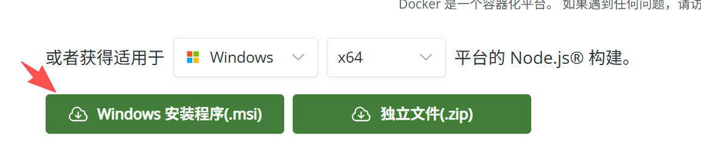
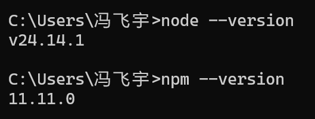
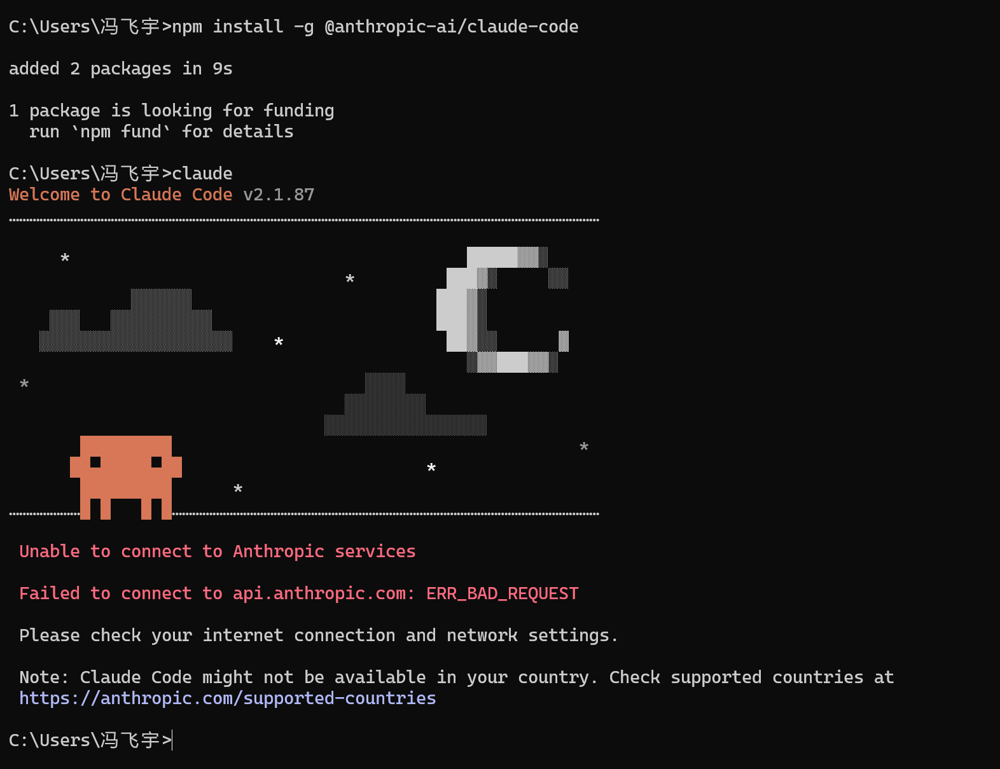
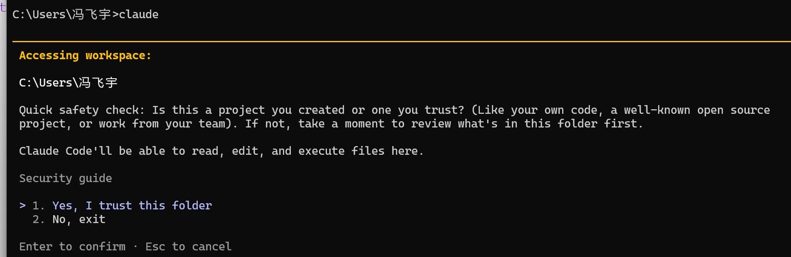
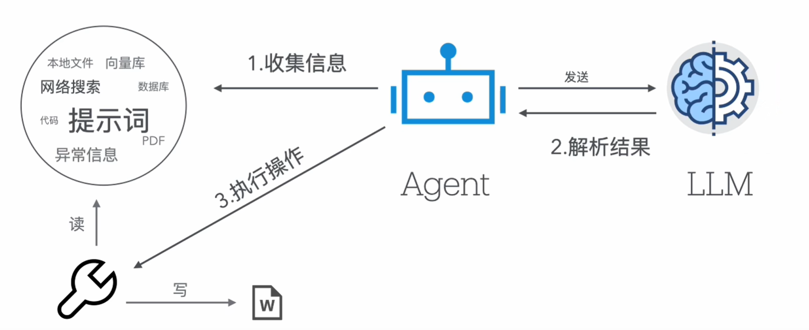
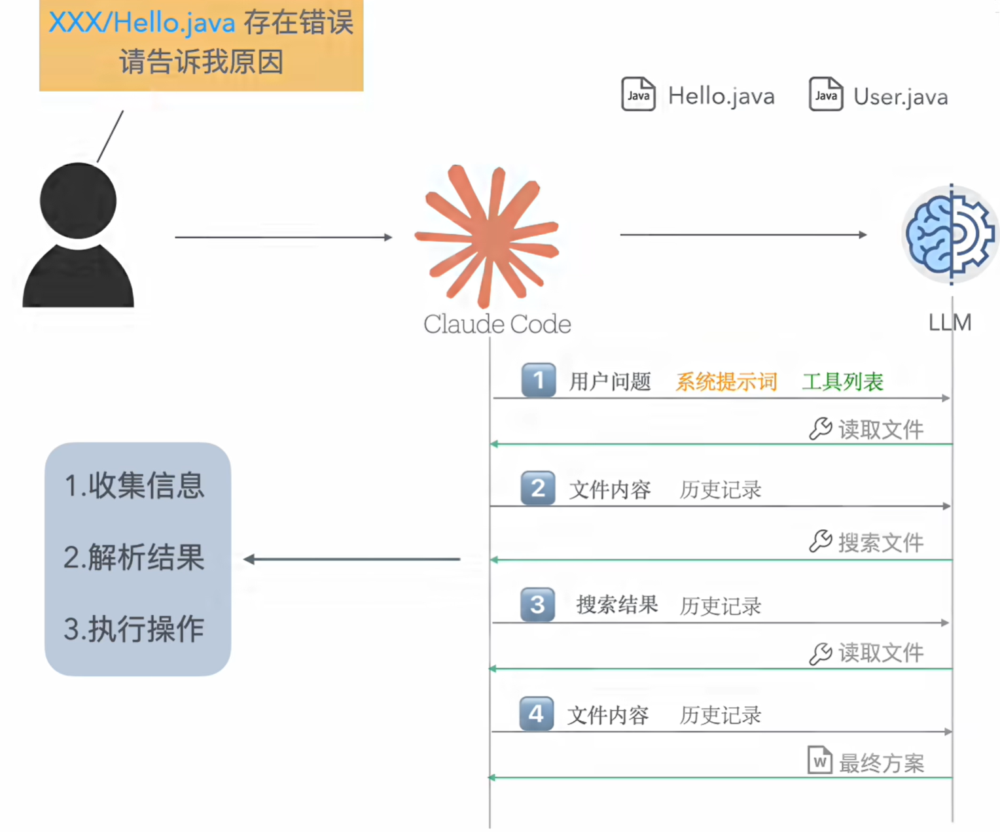
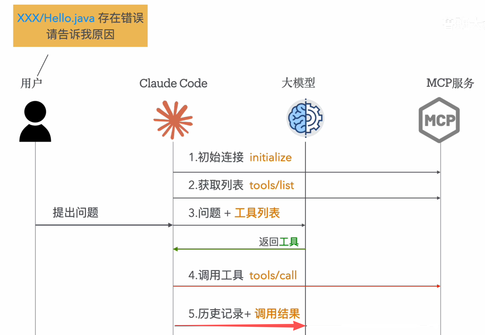
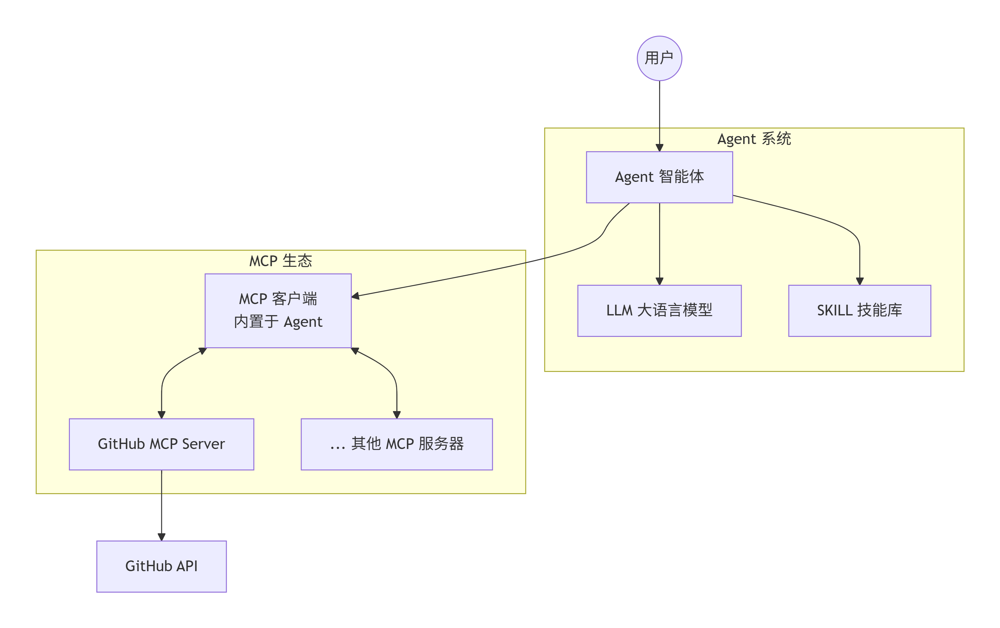
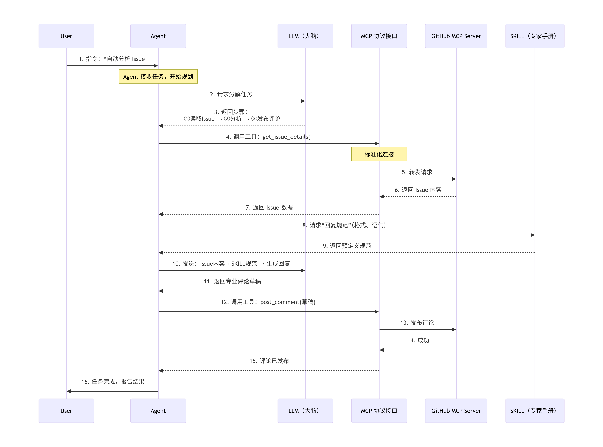
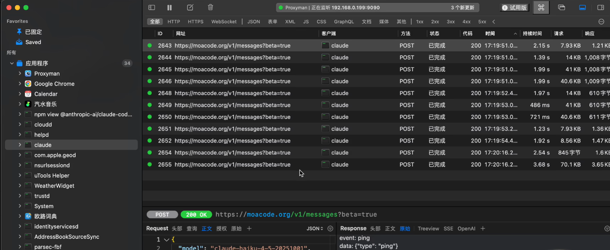

# 1、安装 node.js 

进入网址下载安装包：[Node.js — 下载 Node.js®](https://nodejs.org/zh-cn/download)

下载之后，按步骤依次安装即可。






# 2、安装 Claude 

##  （1）npm 安装 claude：

 ```shell
 npm install -g @anthropic-ai/claude-code
 # 验证
 claude
 ```




## （2）配置 API

由于国内无法直接使用 claude 官方服务，所以使用国内的模式服务商的 API（下面以 DeepSeek 为例，具体可参考 API 提供商）。保存退出后，执行 `claude` 即可。

```json
{
  "firstStartTime": "2026-03-29T08:46:35.516Z",
  "opusProMigrationComplete": true,
  "sonnet1m45MigrationComplete": true,
  "userID": "9de1bb898d47bb58daa83eab805bf3dc943845abe27d8904940e6b8e12f47524",
  "env": {
    "ANTHROPIC_AUTH_TOKEN": "xxx",
    "ANTHROPIC_BASE_URL": "https://api.deepseek.com/anthropic",
    "ANTHROPIC_MODEL": "deepseek-chat",
    "ANTHROPIC_DEFAULT_HAIKU_MODEL": "deepseek-chat",
    "CLAUDE_CODE_DISABLE_NONESSENTIAL_TRAFFIC": "1",
    "API_TIMEOUT_MS": "600000"
  },
  "hasCompletedOnboarding": true 
}
```




# 3、基础概念

在 Claude 的生态系统中，四个概念构成了一个层层递进的完整体系：

- **LLM（大语言模型）**是整个系统的大脑，负责理解和生成语言。

- **Agent（智能体）**让大脑能够自主行动，通过调用工具来完成复杂任务。

- **MCP（模型上下文协议）**是连接大脑与外部世界的标准化"USB接口"。

- **SKILL（技能）**是为大脑预装的"专家操作手册"，规范它在特定任务中的行为。

  

## 🧠  3.1 LLM：核心"大脑"

LLM是Claude聊天机器人的技术基石，它是一种基于海量文本和代码数据训练而成的深度神经网络。其核心能力是**理解**用户输入的自然语言指令，并**生成**连贯、有用的文本回应。

**工作原理**：Claude使用的LLM基于Transformer架构，通过分析词语之间的统计关系来理解上下文。为了让模型更安全、更有帮助，Anthropic还引入了独特的"**宪法AI**"训练方法，让模型在训练过程中学习并遵循一套预设的道德准则。


## 🤖 3.2 Agent：自主行动的"执行者"

如果说LLM是大脑，那Agent就是让这个大脑能够**自主行动**的完整系统（就像人只有大脑做不了任何事，还需要眼睛外界，需要手操作）。它不仅包含LLM，还具备**规划、记忆、工具使用**和**执行**的能力，可以在没有人类每步干预的情况下，独立完成一个多步骤的复杂任务





- **核心能力**：Agent能够将一个大目标（如"调研最新的AI趋势并生成报告"）分解成若干步骤，如：搜索信息、抓取网页内容、分析数据、撰写总结等。它能记住已经完成的步骤和中间结果，并根据情况灵活调整计划。

- **典型应用**：Anthropic推出的**Claude Agent SDK**，正是为了帮助开发者构建这类强大的、可编程的Agent应用。比如，一个Agent可以被设定为：
  
  1. 分析代码变更。
  
  2. 自动编写单元测试。
  
  3. 如果所有测试通过，则创建一个PR并请求审查
  
     

## 🔌 3.3 MCP：标准化的"万能接口"

MCP（模型上下文协议）是一个由Anthropic发起的**开放标准**。它的目标是解决AI模型与外部世界（数据、工具、API）的连接问题，可以理解为AI领域的**"USB-C接口"**。相当于你这个服务开发好了，对于 Agent 来说是一个服务孤岛，他不知道如何使用你这个服务，也不知道这个服务提供哪些功能，所以必须制定统一的协议接口来打通该流程。所有想接入该 AI Agent 的服务都需要实现该接口。例如物模型功能，底层设备提供了哪些功能，都通过物模型协议进度约束实现。



- **解决的问题**：在没有MCP之前，AI每连接一个新的数据源或工具（如GitHub、Slack、本地数据库），都需要一套独立的、定制化的代码。这使得系统难以扩展，且维护成本高昂。

- **工作方式**：MCP采用客户端-服务器架构。
  - **MCP客户端**：如Claude Code、Cursor等AI应用，它们需要获取数据或调用工具。
  - **MCP服务器**：一个轻量级的程序，通过标准化的MCP协议暴露特定功能（如"读取GitHub Issue"或"获取本地文件"）。
  - **交互过程**：Claude（作为客户端）可以根据任务需求，动态地连接到对应的MCP服务器，并调用其提供的"**工具**"来完成任务。这些工具是模型**可控**的，即模型可以决定"调用哪个工具"，但"执行调用"的动作由客户端完成。
  
- **核心价值**：开发者只需为一个工具开发一次MCP服务器，任何支持MCP协议的AI应用都可以直接使用，实现了AI能力的标准化共享和复用。

  

## 📚 3.4 SKILL：预置的"专家手册"

SKILL是Claude中的一种**模块化能力封装机制**。它像一本给AI阅读的"操作手册"或"标准作业流程"，里面包含了如何完成特定专业任务的**方法论、步骤、最佳实践和示例**。

claude 会加载 skills 列表（名称与描述），根据用户的问题去匹配对应的 skill，，之后会请求该 skill 中的全部内容。所以 skill 多了之后 token 会爆炸；

- **与Prompt的区别**：普通的Prompt是临时性的指令，而SKILL是可复用的"技能包"，可以被Claude在任意相关对话中**按需激活**。

- **工作方式**：
  1. 你发起一个任务（例如"按照公司品牌规范做一个PPT"）。
  2. Claude判断这个任务可能需要某个SKILL（例如"Brand Guidelines"技能）。
  3. Claude自动加载该SKILL中包含的指令和规范。
  4. 它会严格按照SKILL中定义的流程和标准来执行任务，确保输出的一致性和高质量。
  
- **SKILL vs. MCP**：这是最核心的区别，两者是**协作而非替代**关系。
  - **MCP连接外部世界，解决的是"能力供给"问题**：模型可以"拿到"数据和使用工具。
  - **SKILL规范内部行为，解决的是"行为规范"问题**：教模型"如何正确、稳定地"使用这些数据和工具来完成任务。
  - **举例**：在一个故障分析场景中，**MCP**可以接入监控系统、数据库和日志平台（提供工具和数据）；而**SKILL**则定义了分析流程：先看什么指标，再查什么日志，最后如何下结论（提供方法论）。
  
  
  
  

## 💎 3.5 总结与协同

总的来说，这四个概念在一个典型的应用场景中会这样协同工作。

#### （1）关系架构图



**核心关系说明**：

- **Agent** 依赖 **LLM** 做所有智力工作。

- **Agent** 读取 **SKILL** 来规范自身行为。

- **Agent** 通过内置的 **MCP 客户端** 与多个 **MCP 服务器** 通信，从而获取工具能力（读 Issue、发评论等）。

  

#### （2）交互时序

> 当你想让 **Agent** 自动分析一个GitHub Issue时：
>
> 1. **Agent** 接收到指令，将其分解为"读取Issue内容"、"分析问题"、"发布评论"等步骤。
> 2. 在执行"读取Issue内容"步骤时，Agent通过标准化的 **MCP** 接口，连接到了GitHub MCP Server。
> 3. GitHub MCP Server向Agent提供了"获取Issue详情"这个 **工具**。
> 4. 在分析问题并准备发布评论时，Agent会遵循"如何专业地回复Issue"这个 **SKILL** 里预设的格式和语气规范。
> 5. 所有这些理解、规划和决策，都由底层的 **LLM** 作为大脑来驱动完成。



- **Agent（执行者）**
  接收用户指令，调用 LLM 做任务分解，通过 MCP 连接外部工具，查询 SKILL 获取行为规范，最终驱动全流程。
- **LLM（大脑）**
  负责理解、规划、生成文本。在步骤 2-3 中做任务分解，在步骤 10-11 中根据数据和规范生成回复草稿。
- **MCP（标准接口）**
  提供统一的“USB-C”式连接。步骤 4-7 和 12-15 中，Agent 无需关心 GitHub API 细节，只需通过 MCP 调用 `get_issue_details` 和 `post_comment` 两个工具。
- **SKILL（专家手册）**
  预置的方法论与规范。步骤 8-9 中 Agent 主动查询，确保评论的格式、语气符合专业要求（例如“禁止情绪化措辞，必须附带引用链接”）。
- **GitHub MCP Server**
  一个具体的 MCP 服务器实现，向 Agent 暴露 GitHub 相关工具。它不属于四大核心概念，但展示了 MCP 的可扩展性。


## 💎 3.6 claude 消耗的 token 会非常多。

主要是因为下面几个原因：

1. **MCP工具描述全部注入**：**所有MCP服务器提供的“工具描述”**（工具名称、功能说明、参数Schema）会输入给 LLM。Claude在每次**规划步骤**（即LLM调用）时，确实会把这些工具描述全部放入系统提示中，让LLM知道“我能调用哪些工具”。如果连接了多个MCP服务器（例如GitHub、Slack、数据库、文件系统），每个服务器可能提供5～20个工具，每个工具描述占用几百到上千Token，**光工具列表就可能消耗几千甚至上万Token**。
2. **Skill描述也全部注入**，且激活后还需加载完整内容：实现中，**所有Skill的“名称+简短描述”**会随每次请求输入LLM。LLM根据用户问题判断需要激活哪些Skill；然后**再加载这些Skill的完整内容**（可能再次消耗Token）供LLM执行时遵循。如果Skill数量多（如几十个），仅描述列表就能占几百到上千Token。
3. **Agent多轮调用LLM**（规划、调用、反思、生成），每轮重复发送系统提示、工具描述、历史。
4. **对话历史累积**（长对话中上下文快速膨胀）。
5. **工具返回的数据量大**（如日志、文档、数据库结果）。
6. **安全与规范开销**（宪法AI系统提示较长）。


#  4、使用教程


## 4.x 命令合集

###  （1）基础交互模式

#### 启动方式

```bash
claude                    # 进入交互式 REPL 模式
claude "任务描述"         # 执行单次任务后退出
claude -p "查询"          # Print 模式（非交互，适合脚本）
claude -c                 # 继续当前目录最近的对话
claude -r <session-id>    # 恢复特定会话
```

#### 交互模式内置命令

进入 `claude` 交互模式后，可以使用以下斜杠命令：

|        命令        | 功能                                |
| :----------------: | :---------------------------------- |
|      `/help`       | 显示帮助信息                        |
|      `/clear`      | 清除对话历史但保留上下文            |
|     `/compact`     | 压缩上下文（减少 token 消耗）       |
|     `/config`      | 打开设置面板                        |
|      `/model`      | 切换模型（Opus/Sonnet/Haiku）       |
|       `/mcp`       | 管理 MCP 服务                       |
|     `/memory`      | 管理记忆                            |
|    `/commands`     | 列出所有可用的 skills 和命令        |
|      `/hooks`      | 查看配置的 hooks                    |
|     `/skills`      | 列出可用的 Skills（包括你自定义的） |
|     `/bashes`      | 查看后台运行的进程                  |
|    `/kill <id>`    | 停止后台进程                        |
| `exit` 或 `Ctrl+C` | 退出                                |

### （2）代码库操作（核心功能）

#### 代码理解与导航

```plain
> 解释这个项目是做什么的
> 分析项目结构并绘制架构图
> 找到处理用户认证的代码
> 解释这个函数的作用
> 查找所有使用 raw SQL 的查询
```

#### 代码编辑（需要权限确认）

```plain
> 给 login 函数添加输入验证，检查邮箱格式和密码长度
> 将 authentication 模块重构为 async/await
> 修复第 45 行的空指针异常
> 给所有 API 端点添加类型注解
> 重命名 UserManager 类为 UserService 并更新所有引用
```

#### 批量重构

```plain
> 把项目中所有 var 声明改为 let 或 const
> 将所有回调函数改为箭头函数
> 统一错误处理，使用自定义的 AppError 类
```

### （3）系统与 Shell 操作

#### 执行命令

Claude 可以运行 shell 命令并分析结果：

```plain
> 运行测试套件并修复失败的测试
> 检查磁盘使用情况并清理大文件
> 查看最近的 git 提交历史
> 扫描端口占用情况
```

#### 后台任务

```plain
> 在后台运行 npm run build，完成后通知我
> 监控 app.log，如果出现 ERROR 级别日志就告诉我
```

### （4）Git 工作流集成

```bash
# 在交互模式中：
> 提交更改并写一个有意义的提交信息
> 创建一个新的 feature 分支用于用户认证功能
> 查看当前更改的差异
> 将 main 分支合并到当前分支并解决冲突
> 为这个功能创建 PR

# 快捷命令：
claude commit             # 自动创建提交
```

### （5）使用你的自定义 Skill

你提到已经创建了一个 skill，以下是管理和使用 skills 的方法：

#### 查看和调用 Skills

```plain
/skills                   # 列出所有可用 skills（包括自定义的）
/commands                 # 查看所有命令
```

#### 调用自定义 Skill

```bash
# 方式一：直接名称调用（如果 skill 名为 my-skill）,创建了带参数的 skill，可以这样调用
> /my-skill 参数1 参数2

# 方式二：通过自然语言 arguments 传递
> 使用 my-skill 处理这个数据
```


## 4.x 自定义 SKILL

SKILL 需要根据你希望它生效的范围，放在两个不同的位置。无论选择哪种存放位置，每个 Skill 都必须是一个独立的文件夹，且文件夹内必须包含一个 `SKILL.md` 的核心文件。

| 存放类型        | 路径                             | 适用范围                          |
| :-------------- | :------------------------------- | :-------------------------------- |
| **个人 Skills** | `~/.claude/skills/[skill-name]/` | 当前电脑用户的所有项目            |
| **项目 Skills** | `.claude/skills/[skill-name]/`   | 仅当前项目，可提交 Git 与团队共享 |

Claude Code 在启动时会**同时扫描并加载所有位置**的 Skills（个人、项目、插件、企业）。当存在**同名 Skill** 时，会按照以下**优先级**决定哪个生效：

```
企业 Skills (Enterprise) > 个人 Skills (Personal) > 项目 Skills (Project) > 插件 Skills (Plugin)
```

一个规范的 Skill 目录结构如下：

```
# 以项目级 Skill 为例
your-project/
├── .claude/
│   └── skills/
│       └── my-code-reviewer/     # Skill 名称，必须与 SKILL.md 中一致
│           ├── SKILL.md          # 核心指令文件
│           ├── reference.md      # (可选) 详细参考资料
│           └── scripts/          # (可选) 辅助脚本
├── src/
└── ...
```

虽然启动时**扫描**了所有 Skills 目录，但**并不会把所有 SKILL.md 的完整内容都加载到上下文**。实际流程是：

1. **启动阶段**：只读取每个 Skill 的 **YAML 元数据**（`name` 和 `description`），大约几十个 Token
2. **匹配阶段**：Claude 根据用户的自然语言和这些 `description` 判断是否需要某个 Skill
3. **激活阶段**：只有当 Skill 被判定为“相关”时，才会读取完整的 `SKILL.md` 内容注入到上下；

这种设计确保了即使你安装了 100 个 Skills，也不会浪费上下文窗口

---

**SKILL 的写法可参考**：https://github.com/anthropics/skills/tree/main/skills

```markdown
---
name: my-reviewer
description: 专门用于审查代码风格和潜在 Bug。当用户要求“审查代码”、“检查规范”或提交 PR 时使用。
---

# 代码审查专家

## 指令
1. 检查变量命名是否符合项目规范（小驼峰）。
2. 识别未捕获异常的潜在风险。
3. 输出格式：必须包含“问题行数”、“严重程度（高/中/低）”和“修改建议”。

## 示例
用户输入：`审查 app.js`
输出应严格遵循表格形式...
```

- **元数据 (Frontmatter)**：`name` 和 `description` 最关键。**`description` 要写得“略微激进”一些，明确列出触发条件，否则 Claude 可能不会自动调用**。
- **主体内容**：用清晰的步骤告诉 Claude 该怎么做，最好附带示例。

---

Skill 有两种主要的使用模式，可以通过元数据中的 `disable-model-invocation` 字段来区分 ：

| 调用方式     | 元数据设置                               | 使用场景                                                     |
| :----------- | :--------------------------------------- | :----------------------------------------------------------- |
| **自动触发** | `disable-model-invocation: false` (默认) | 定义“如何做事”的规范。例如“**按团队规范审查代码**”，Claude 会在相关对话中自动加载并遵循。 |
| **手动触发** | `disable-model-invocation: true`         | 定义“做什么事”的任务。例如“**生成 PR 描述**”或“**执行部署**”，需要你明确输入 `/generate-pr` 来调用。 |

​	


# 5、工具推荐

（1）proxyman ： http 协议抓包，可以解析 claude 交互过程；

