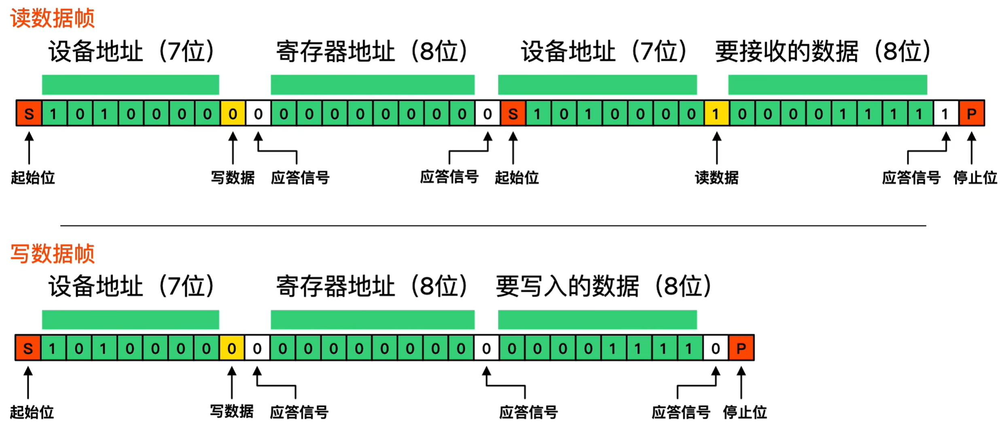
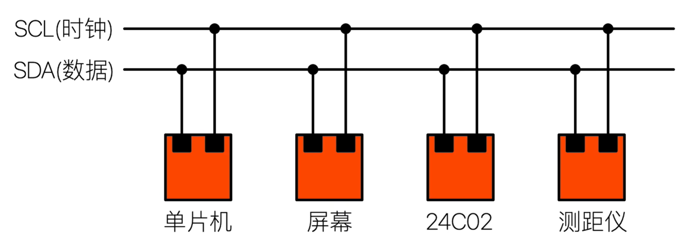
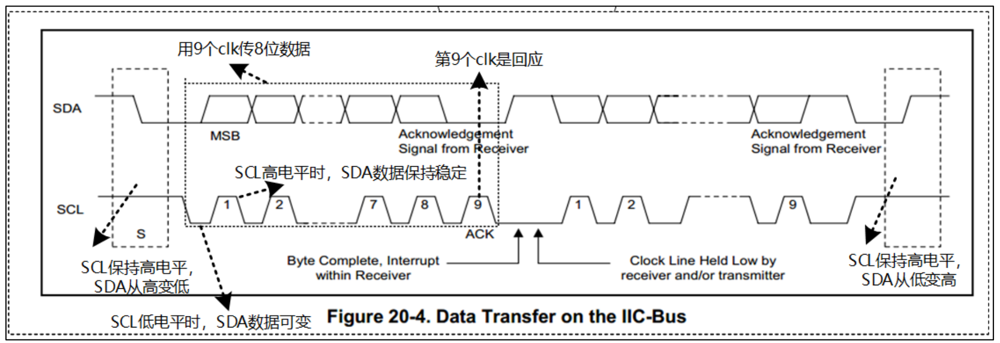
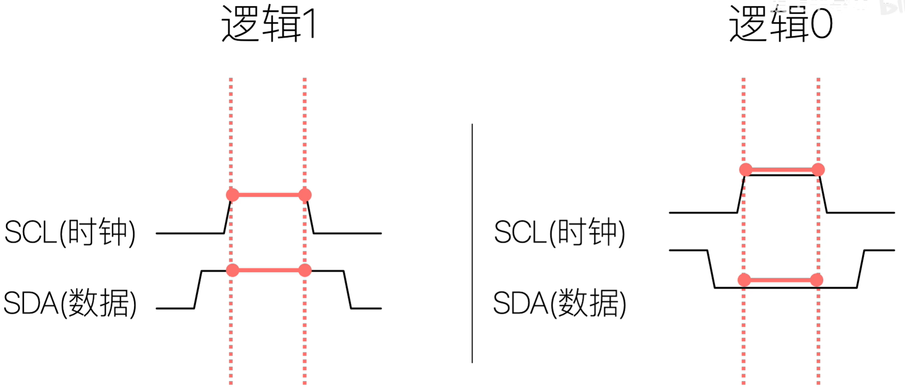
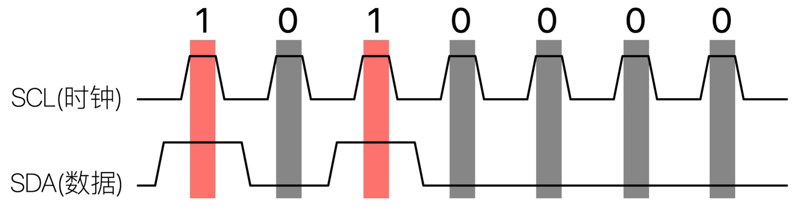
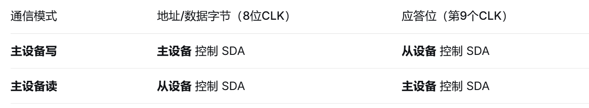

## 1、传输次序

一主多从。

（1）主芯片要发出一个 start 信号；

（2）发出一个设备地址(用来确定是往哪一个芯片写数据)，方向(读/写，0 表示写，1 表示读)；

（3）从设备回应(用来确定这个设备是否存在)，然后传输数据；

（4.1）**主设备向从设备写入数据**：**主设备**通过SDA发送第一个数据字节（8位），**从设备**接收完这个字节后，在SDA上发送一个**ACK**。（主发一个完整字节（8个时钟脉冲），然后**主释放SDA线**，在下**一个时钟脉冲**，由**从设备控制SDA线**来发送ACK位。这是一个“主 -> 从 -> 主 -> 从 ...”的交替过程）。

（4.2）**主设备从从设备读数据**：**从设备**接管SDA线，开始向主设备发送第一个数据字节（8位）；**主设备**在接收完这个字节后，在SDA上发送一个**ACK**（表示还要读下一个字节）或**NACK**（表示停止读取）；重复此过程，从设备发送N个字节，主设备逐个应答（最后一个应答为NACK）。（**从设备发送一个完整字节**，然后**从设备释放SDA线**，在下**一个时钟脉冲**，由**主设备控制SDA线**来发送ACK/NACK位。这是一个“从 -> 主 -> 从 -> 主 ...”的交替过程。）

（5）每传输一字节数据，接收方要有一个回应信号（确定数据是否接受完成)，然后再传输下一个数据；

（6）数据发送完之后，主芯片就会发送一个停止信号；

## 2、传输控制

I2C 传输数据需要 SCL 时钟线与 SDA 数据线。读写一帧数据是由 SCL 与 SDA 共同作用的。

I2C 协议中数据传输的单位是字节，也就是 8 位。但是要用到 9 个时钟：前面 8 个时钟用来传输 8 数据，第 9 个时钟用来传输回应信号。

* 开始信号（S）：SCL 为高电平时，SDA 山高电平向低电平跳变，开始传送数据；

* SDA 上传输的数据必须在 SCL 为高电平期间保持稳定；SDL 为高电平时表示逻辑 1，为低电平时表示逻辑 0；

  

  

* 结束信号（P）：SCL 为高电平时，SDA 由低电平向高电平跳变，结束传送数据

## 3、协议细节

### （1）如何在 SDA 上实现双向传输？

主芯片通过一根 SDA 线既可以把数据发给从设备，也可以从 SDA 上读取数据，连接 SDA 线的引脚里面必然有两个引脚（发送引脚/接受引脚）。

### （2）主、从设备都可以通过 SDA 发送数据，肯定不能同时发送数据，怎么错开时间？

​	**在I2C总线上，只有“主设备”有资格发起和结束一次数据传输（生成时钟SCL），而“从设备”则被动响应。** 但主设备和从设备都**可以**在SDA线上发送数据，只是它们被巧妙地安排在了**不同的时间片**，并通过**时钟同步**和**应答机制**来实现协同。

​	I2C协议通过四种关键机制确保主从设备不会在SDA线上冲突：

* **严格的通信阶段划分**：每一次数据传输都被清晰地划分为“地址帧”、“数据帧”和“应答位”。主设备永远负责发送起始条件、地址帧和停止条件。
* **时钟同步与“从设备拉低时钟”**：SCL由主设备产生，但从设备在需要更多时间处理数据时，可以拉低SCL以强制主设备进入等待。这确保了从设备只有在准备好后，数据才会被读取。
* **主设备发送 vs 从设备发送模式**：在地址帧中，有一个**读写位**明确指示了后续数据帧的流向。
* **应答机制**：每一个字节传输后，接收方必须发送一个应答位。这就像一个握手信号，确保发送方知道接收方已准备好接收下一个字节。

### （3）双方设备中，某个设备发送数据时，另一方怎样才能不影响 SDA 上的数据？

​	I2C 协议的优雅之处正在于它如何用最简单的硬件实现“一方发送，另一方绝对不影响”的机制。答案是：**通过“线与”逻辑、开漏输出和严格的总线状态管理**（开漏输出 + 上拉电阻）。

* **开漏输出**：I2C设备连接到SDA和SCL的引脚都配置为**开漏输出模式**。

  - 这意味着每个设备的输出级**只能主动将总线拉低（连接到地）**，**不能主动输出高电平**。

  - 当设备不主动拉低总线时，输出引脚处于**高阻态**（相当于断开连接），不会影响总线状态。

* **上拉电阻**：SDA和SCL线上各有一个**外部上拉电阻**连接到电源Vcc。

  - 当**所有设备**都不拉低总线时，上拉电阻将总线电平**拉到高电平（逻辑1）**。

  - 这是总线的“默认空闲状态”。

#### 场景1：发送方发送逻辑“1”

- **发送方**：不拉低总线，将SDA引脚置于**高阻态**。
- **总线状态**：上拉电阻将SDA线自动拉到高电平。
- **接收方**：可以安全地检测到高电平（逻辑1），且其自身的高阻态状态不会干扰这个过程。
- **关键点**：发送“1”实际上是**“放弃控制权”**，让上拉电阻来做这件事。

#### 场景2：发送方发送逻辑“0”

- **发送方**：主动将SDA引脚连接到地，**强有力地拉低总线**。
- **总线状态**：无论其他设备想做什么，SDA线都会被强制拉低到接近0V。
- **接收方**：检测到低电平（逻辑0）。即使接收方此时错误地想输出高电平，由于它是开漏输出，**它无法与发送方的强下拉对抗**。
- **关键点**：“0”是**“强力控制”** 的状态。

#### 场景3：冲突检测与仲裁

这种设计天然支持**多主机仲裁**：

- 如果两个主设备同时发送数据：
  - 两者都发“1”：总线为高，相安无事。
  - 两者都发“0”：总线为低，相安无事。
  - **一个发“1”（不拉低），一个发“0”（拉低）**：总线被发“0”的设备强制拉低。
  - 发“1”的设备检测到自己想发高电平但总线实际是低电平，就**知道自己输了仲裁**，立即释放总线。
